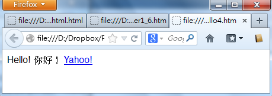
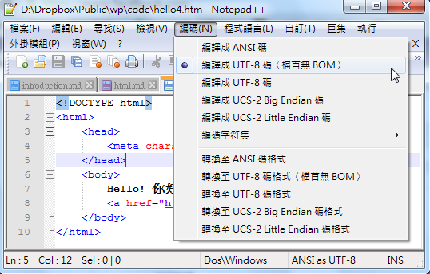
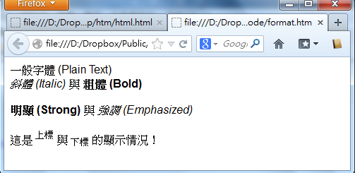
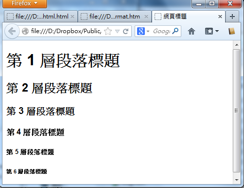
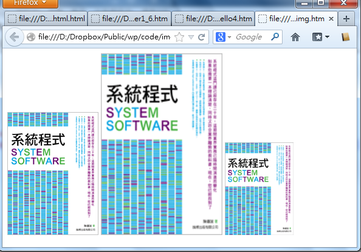
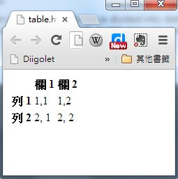
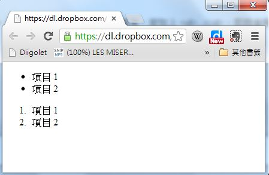
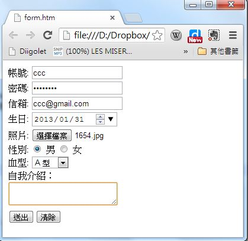

# HTML 網頁設計

## HTML、CSS 與 JavaScript

HTML、CSS 與 JavaScript 是讓 Web Browser 運作的三大技術，要學會 Web 程式設計的第一步，就是要學會這三項技術，在本章中，我們將從最基礎的 HTML 開始。

如果您想要學習這些技術，筆者強烈的推薦您觀看 w3schools 這個網站，網址如下。

* <http://www.w3schools.com/>

學習 HTML、CSS、JavaScript 的順序，最好先從 HTML 開始，因為 HTML 最簡單，而且是整個 Web 技術的表現語言，學會 HTML 之後就可以學習 CSS，看看如何對 HTML 進行格式化套表呈現的動作，然後再進一步學習 JavaScript 這個小型程式語言，以便讓網頁更加動態，增強網頁的的互動功能。

以下是 w3schools 當中這三個主題的網頁，如果您是一個程式設計師，相信您可以用很短的時間就學會這些主題。

* <http://www.w3schools.com/html/default.asp>
* <http://www.w3schools.com/css/default.asp>
* <http://www.w3schools.com/js/default.asp>

一但學會了 HTML、CSS、JavaScript 這三種技術，您就可以開始向 Server 端的技術邁進了。

## 簡易網頁

HTML 網頁是一種純文字檔案，您只要用記事本這樣的文字編輯器就可以輕易的編出來，以下是一個範例：

```html
<html>
<body>
Hello!
</body>
</html>
```

檢視檔案：<https://dl.dropbox.com/u/101584453/wp/code/hello1.htm>

您可以看到在上述範例中，Hello! 訊息被夾在 `<body>` 與 `</body>` 中間，而外層又有 `<html>` 與 `</html>` 包覆，像這樣的結構稱為標記語言 (Markup Language)。

如果我們在上述文件中再加上一句 `<a href="http://tw.yahoo.com/">Yahoo!</a>` 這樣的標記，那麼網頁中將會出現 Yahoo! 這個詞彙，該詞彙通常是藍色文字，而且可以用滑鼠點擊，當您點擊之後網頁就會被導到 Yahoo 台灣的首頁，這種點選後會導入另一個網頁的機制是 Web 的最大特色，稱為 Hyperlink (超連結)，而那些被 `<a> </a>` 標記起來的文字，就稱為 Hyper Text (超文字)。

```html
<html>
<body>
Hello! 
<a href="http://tw.yahoo.com/">Yahoo!</a>
</body>
</html>
```

(筆者註：標記 a 當中的 href 是 Hyperlink Reference (超連結引用) 的縮寫，而 a 則是 anchor (錨) 的意思)。

檢視檔案：<https://dl.dropbox.com/u/101584453/wp/code/hello2.htm>

而這也正是 HTML 之全名 Hyper Text Markup Language 的意義，也就是一種含有超連結的標記語言。

由於 HTML 標記語言是有層次性的，因此在排版時我們經常都會使用縮排以凸顯出這種層次感，例如以上的範例經過縮排之後就變成了如下的情況。

```html
<html>
	<body>
		Hello! 
		<a href="http://tw.yahoo.com/">Yahoo!</a>
	</body>
</html>
```

檢視檔案：<https://dl.dropbox.com/u/101584453/wp/code/hello3.htm>

這樣的結構看起來更加一目了然，能夠凸顯出每個層次之間的包含關係。

## HTML 的表頭

雖然上述範例已經是 HTML 網頁了，而且也通常可以正常檢視了，但是還不夠完整，一個完整的 HTML 網頁通常要包含足夠的表頭資訊，以便讓瀏覽器能正確的辨認這個網頁的類型與編碼方式，以下是一個範例：

```html
<!DOCTYPE html>
<html>
	<head>
		<meta charset='utf-8'> 
	</head>
	<body>
		Hello! 你好！
		<a href="http://tw.yahoo.com/">Yahoo!</a>
	</body>
</html>
```

檢視檔案：<https://dl.dropbox.com/u/101584453/wp/code/hello4.htm>



其中第一句的 `<!DOCTYPE html>` 是告訴瀏覽器，這個文件是一個 HTML 檔案，而  `<meta charset='utf-8'>` 這句話，則是告訴瀏覽器這個文件的編碼是用 UTF-8 的格式。

所以您必須將上述檔案，儲存成 unicode 的 UTF-8 格式，這樣網頁才能正確運作，否則就有可能出現亂碼的情況，以下是筆者使用 Notepad++ 設定 UTF-8 格式的情況。



## 格式化

從上述範例中，您可以看到即使我們在 HTML 的原始文字檔案中進行換行，但是呈現出來的結果卻沒有換行，如果您真的想要強制換行的話，在 HTML 當中必須用 `<BR/>` 這個標記，才能讓文字真正換行。

但是強制換行並不是一個好的寫法，比較好的方法是用段落標記 `<p>...</p>` 把您的段落包起來，這樣在段落結束後就會換行了。

另外、還有 `<b>...</b>` 標記 (也可以用 `<strong> ... </strong>`) 可以讓文字變粗體，而 `<i>...</i>` 指令則可以讓文字呈現斜體，`<em> ... </em>` 標記可以強調文字，而 `<code>...</code>` 可以讓文字以類似程式碼的字型輸出。

若要讓文字變成上標，可以用 `<sup>...</sup>`，或用 `<sub>...</sub>` 則可以讓文字變下標，以下範例綜合的呈現了這些格式化標記的結果。

```html
<!DOCTYPE html>
<html>
	<head>
		<meta charset='utf-8'> 
	</head>
	<body>
	  一般字體 (Plain Text) <BR/>
	  <i>斜體 (Italic)</i> <BR/>
	  <b>粗體 (Bold)</b> <BR/>
	  <p>
		<strong>明顯 (Strong)</strong>
		<em>強調 (Emphasized)</em>
	  </p>
	  <p>
		這是 <sup>上標</sup> 與 <sub>下標</sub> 的顯示情況！
	  </p>
	</body>
</html>
```


檢視檔案：<https://dl.dropbox.com/u/101584453/wp/code/format.htm>



## 標題

HTML 的章節標題共有六種層次，從 h1 到 h6，通常 h1 代表最大的第一層標題，會用最大的字型顯示，而 h6 則是最小的第六層標題，會用最小的字型顯示。

```html
<h1>第 1 層段落標題</h1>
<h2>第 2 層段落標題</h2>
<h3>第 3 層段落標題</h3>
<h4>第 4 層段落標題</h4>
<h5>第 5 層段落標題</h5>
<h6>第 6 層段落標題</h6>
```

而整個網頁的標題則是用 `<title>...</title>` 進行標記，如下所示。

```html
<title>網頁標題</title>
```

以下是這些標題的使用範例，您可以點選看看。

檢視檔案：<https://dl.dropbox.com/u/101584453/wp/code/header1_6.htm>



## 影像 Image

在 HTML 中，要顯示影像或圖片，只要使用 `` 就行了。如果要指定大小，就可以加上 width 與 height 屬性，如以下範例所示。

```html


```

上述第一個指令 `` 會按照原圖大小顯示，而 `` 則會將圖形縮放到寬度 200，高度 300 的大小，最後一個用 20% 代表縮放到寬度為瀏覽器畫面視窗的百分之二十那麼大。

檢視檔案：<https://dl.dropbox.com/u/101584453/wp/code/img.htm>



評論：竟然趁機為自己的書打廣告，真是太惡劣了！....

## 表格 Table

在 HTML 當中、有很多排版都是使用表格的方式製作的，例如「側欄、上方橫幅」等等，表格的語法如以下範例所示。

```html
<table>
<tr>
<th></th>
<th>欄 1</th>
<th>欄 2</th>
</tr>
<tr>
<th>列 1</th>
<td>1,1</td>
<td>1,2</td>
</tr>
<tr>
<th>列 2</th>
<td>2, 1</td>
<td>2, 2</td>
</tr>
</table>
```

表格的語法都是由 `<table>...</table>` 所夾住的，其中 `<tr>...</tr>` 會夾住一個列，而每個列又可以分成數個欄，這些欄可能用 `<th>..</th>` 或 `<td>...</td>` 夾住，其中 th 通常是用在標頭、而 td 則是用在內容。

檢視檔案：<https://dl.dropbox.com/u/101584453/wp/code/table.htm>



## 項目 list

HTML 的項目是用 `<li>...</li>` 語法所框住的，如果在項目的外面加上 `<ul>...</ul>` ，那就會顯示無編號的項目清單，若加上 `<ol>...</ol>`，那就會顯示有編號的項目清單。

無編號項目清單：

```html
<ul>
<li>項目 1</li>
<li>項目 2</li>
</ul>
```

有編號項目清單：

```html
<ol>
<li>項目 1</li>
<li>項目 2</li>
</ol>
```

檢視檔案：<https://dl.dropbox.com/u/101584453/wp/code/list.htm>




## 表單 Form

在 HTML 當中，表單 (Form) 是指可以讓使用者進行輸入的元件，其語法是用 `<form> ...</form>` 夾住一堆的輸入元件，這些輸入元件包含 input (輸入)、 textarea (文字區)、 select (選項) 等，其中的 input 還可以根據其 type 欄位顯示成 checkbox, color, date, datetime, datetime-local, email, file, hidden, image, month, number, password, radio, range, reset, search, submit, tel, text, time, url, week 等各種不同的輸入欄形式，以下是一個表單的範例。

```html
<form action="signup" method="post">
帳號: <input type="text" name="user"/><br/>
密碼: <input type="password" name="password"/><br/>
信箱: <input type="email" name="email"/><br/>
生日: <input type="date" name="birthday"/><br/>
照片: <input type="file" name="picture"/><br/>
性別: <input type="radio" name="sex" value="male" checked/> 男
      <input type="radio" name="sex" value="female"/> 女<br/>
血型: <select name="BloodType">
        <option value="A">A 型</option>
        <option value="B">B 型</option>
        <option value="AB">AB 型</option>
        <option value="O">O 型</option>
      </select> <br/>
自我介紹： <br/>
<textarea name="AboutMe">
</textarea> <br/>

<input type="submit" value="送出"/><input type="reset" value="清除"/><br/>
</form>
```

檢視檔案：<https://dl.dropbox.com/u/101584453/wp/code/form.htm>



在上述的範例中，當 submit 類型的送出鈕被按下後，瀏覽器會將這些填寫的資訊，以第一章所說的 GET/POST 方式，發送給伺服器，如果 method 欄位是 GET，那麼會採用在 HTTP 表頭網址處傳送 singup?user=xxx&password=xxx .....這樣的形式送出，這種方式會將密碼顯示在瀏覽器的網址列上，比較容易被看到，若 method 欄位是 POST，則會在 HTTP 表頭尾端加上 user=xxx&password=xxx ... 的資訊，不會在網址列上被看到。當然、如果有人監控網路上訊息的話，還是會看得到這些輸入資訊。

若要更安全，則必須採用 HTTPS 的 SSL 方式傳遞，這種方式會對訊息加密編碼，就比較不會有輸入訊息外洩的危險。


## 參考文獻
* W3School : HTML Turorial -- <http://www.w3schools.com/html/default.asp>
