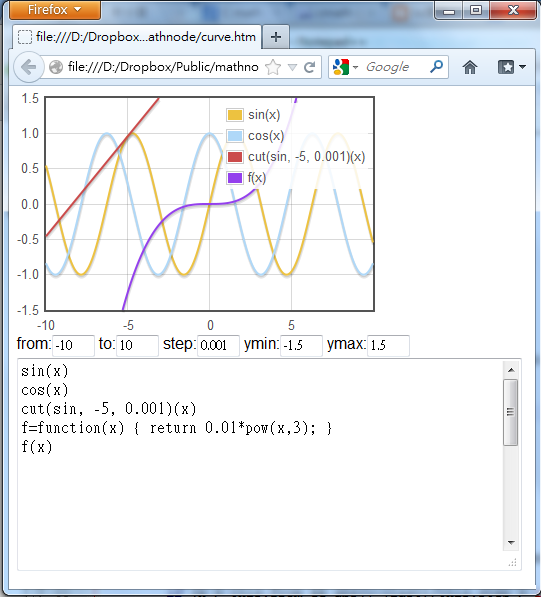

# jQuery 的延伸插件

## 2D 繪圖函式庫 -- jQuery.flot

* flot 是繪圖函式庫 -- <http://people.iola.dk/olau/flot/examples/> (可互動，超讚！)
 * jquery.flot.image.js 可以讓 flot 所繪的圖輸出成為一個 image
  * <http://code.google.com/p/flot/source/browse/trunk/jquery.flot.image.js?r=194>

```html
<html>
 <head>
    <meta http-equiv="Content-Type" content="text/html; charset=utf-8">
    <title>Flot Examples</title>
    <link href="layout.css" rel="stylesheet" type="text/css">
    <!--[if lte IE 8]><script language="javascript" type="text/javascript" src="../excanvas.min.js"></script><![endif]-->
    <script language="javascript" type="text/javascript" src="http://people.iola.dk/olau/flot/jquery.js"></script>
    <script language="javascript" type="text/javascript" src="http://people.iola.dk/olau/flot/jquery.flot.js"></script>
 </head>
    <body>
    <div id="placeholder" style="width:600px;height:300px;"></div>

<script type="text/javascript">
$(function () {
    var d1 = [], dcos=[];
    for (var i = 0; i < 14; i += 0.5)
        dcos.push([i, 5*Math.cos(i)]);

    for (var i = 0; i < 14; i += 0.5)
        d1.push([i, Math.sin(i)]);
    	
    var d2 = [[0, 3], [4, 8], [8, 5], [9, 13]];

    // a null signifies separate line segments
    var d3 = [[0, 12], [7, 12], null, [7, 2.5], [12, 2.5]];
    
    $.plot($("#placeholder"), [ dcos, d1, d2, d3 ]);
});
</script>

 </body>
</html>
```

## 繪製任意函數 curve.htm -- 使用 jQuery.flot

為了繪製函數圖形，筆者曾經利用 jQuery.flot 設計了一個可以輸入 JavaScript 函數或程式，然後在畫面上繪出對應圖形的程式，在此列出以供大家參考。

1. 您可以輸入任何單變數函數，變數名稱必須是 x，像是右圖中的 sin(x) 與 cos(x)。

2. 您可以會出割線或切線，語法是 cut(f, a, dx)，其中 f 為某函數，割線的兩個端點分別為 (a,a+dx) ，如果 dx 很小，那畫出來的割線就差不多是切線了。

3. 您也可以自行定義函數，像是右圖中的 f=function(x) { return 0.01*pow(x,3); } 這一行，代表 ，語法必須符合 JavaScript 語言。



程式碼：curve.htm

```html
<html>
 <head>
    <meta http-equiv="Content-Type" content="text/html; charset=utf-8">
    <!--[if lte IE 8]><script language="javascript" type="text/javascript" 
    src="../excanvas.min.js"></script><![endif]-->
    <script language="javascript" type="text/javascript" 
    src="http://people.iola.dk/olau/flot/jquery.js"></script>
    <script language="javascript" type="text/javascript" 
    src="http://people.iola.dk/olau/flot/jquery.flot.js"></script>
 </head>
<body>

<div id="placeholder" style="width:360px;height:240px;"></div>

<div>
from:<input id="from" type="text" value="-10" size="4"/>
to:<input id="to" type="text" value="10" size="4"/>
step:<input id="step" type="text" value="0.1" size="4"/>
ymin:<input id="ymin" type="text" value="-1.5" size="4"/>
ymax:<input id="ymax" type="text" value="1.5" size="4"/>
</div>

<textarea id="shell" cols="60" rows="10">
sin(x)
cos(x)
cut(sin, -5, 0.01)(x)
f=function(x) { return 0.01*pow(x,3); }
f(x)
</textarea>

<script type="text/javascript">

var sin=Math.sin;
var cos=Math.cos;
var tan=Math.tan;
var cot=Math.cot;
var sec=Math.sec;
var csc=Math.csc;
var ceil=Math.ceil;
var exp=Math.exp;
var floor=Math.floor;
var log=Math.log;
var max=Math.max;
var min=Math.min;
var pow=Math.pow;
var p=Math.pow;
var random=Math.random;
var round=Math.round;
var abs=Math.abs;
var sqrt=Math.sqrt;

function cut(f, a, dx) {
	var fa = f(a);
	var fb = f(a+dx);
	return function(x) { return fa + (fb-fa)/dx * (x-a); }
}

function ExpCurve(from, to, step) {
  this.from = from;
  this.to = to;
  this.step = step;
  this.plotsList = [];

  this.curve = function(code, ymin, ymax) {
    var plots = [];
    for (var x = this.from; x < this.to; x += this.step) {
		var y = eval(code);
		if (x > this.from && abs(y-ylast)/this.step > 1000.0) // 斜率太大，近乎垂直，中斷處不畫
			plots.push(null);
		plots.push([x, y]);
		if (y < ymin-100 || y > ymax+100) // 超出範圍，超出點不畫
			plots.push(null);
		ylast = y;
	}
    return { label: code, data: plots };
  }

  this.curveList = function(codeList, ymin, ymax) {
    var size=this.plotsList.length;
    for (var i=0; i<codeList.length; i++) {
		if (codeList[i].indexOf("=") >=0) {
			eval(codeList[i]);
			this.plotsList[size+i] = {};
		} else
			this.plotsList[size+i] = this.curve(codeList[i], ymin, ymax);
	}
    return this.plotsList;    
  }

  return this;
}

function drawCurveList(target, codeList, from, to, ymin, ymax, step) {
  eval("fx = function(x) { return x; }");
  var c = new ExpCurve(from, to, step);
  $.plot($(target), c.curveList(codeList, ymin, ymax), {
		yaxis: { min: ymin, max: ymax }, 
        series: {
            lines: { show: true },
            points: { show: false },
			bars: { show: false, barWidth: step }, 
        }  
  });
  return c;
}

function drawGraph() {
    var from = eval($("#from").val());
    var to   = eval($("#to").val());
    var ymin = eval($("#ymin").val());
    var ymax = eval($("#ymax").val());
    var step = eval($("#step").val());
    var codeList = $("#shell").val().split("\n");
    return drawCurveList("#placeholder", codeList, from, to, ymin, ymax, step);
}

function keyEnter(event) {
  if (event.which == 13) {
//     event.preventDefault();
     drawGraph();
  }
}

$(drawGraph);
$("#shell").keypress(keyEnter);
$("#from").keypress(keyEnter);
$("#to").keypress(keyEnter);
$("#step").keypress(keyEnter);
</script>

 </body>
</html>
```

## 相關套件
* D3JS: A new area of dashboarding
	* <http://diethardsteiner.blogspot.tw/2012/08/d3js-new-area-of-dashboarding.html?spref=fb>
* flot
	* Example : <http://people.iola.dk/olau/flot/examples/> (可互動，超讚！)
* sparkline
	* <http://omnipotent.net/jquery.sparkline/2.0/jquery.sparkline.min.js>
* jqPlot -- <http://www.jqplot.com/tests/>
	* 與 jQuery 整合，樸素撰寫簡單。
* Flot -- <http://people.iola.dk/olau/flot/examples/>
	* 類似 jqPlot，但圖較優美，不過純粹是線圖。
* <http://www.filamentgroup.com/examples/jqueryui-visualize/>
	* jqueryui-visualize -- 一行程式就完成了 $('table').visualize();
* <http://mbostock.github.com/d3/ex/stack.html>
	* 高品質
* <http://www.highcharts.com/>
* <http://jsxgraph.uni-bayreuth.de/showcase/>
	* 科學計算圖
* 5个主流jQuery图表生成插件评测
	* <http://blog.luluui.com/5-top-jquery-chart-libraries/>
* 10 Best Javascript Drawing and Canvas Libraries
	* <http://javascript.open-libraries.com/utilities/drawing/10-best-javascript-drawing-and-canvas-libraries/>
	* Flotr Documentation -- <http://solutoire.com/flotr/docs/>
