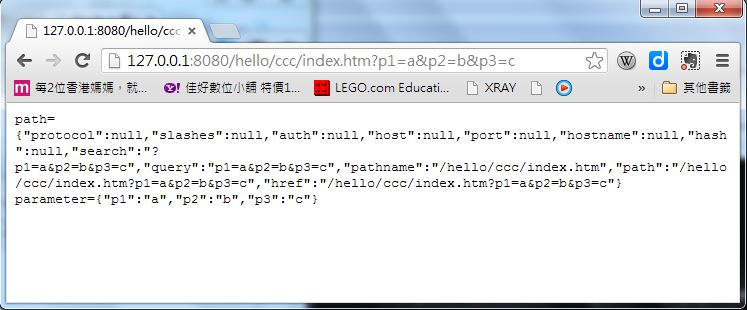
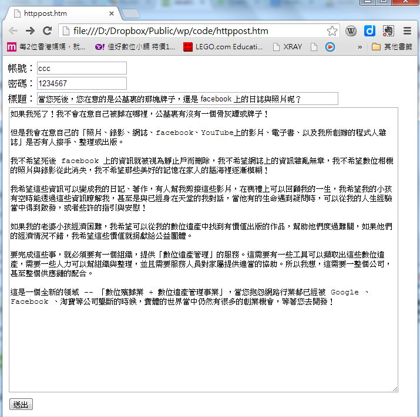
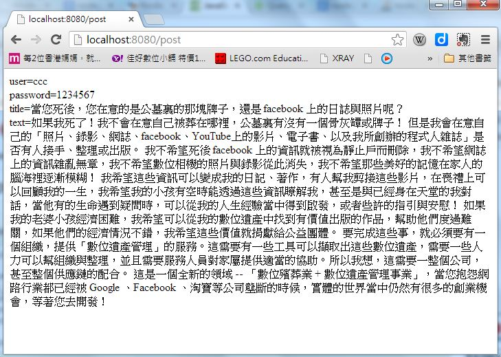
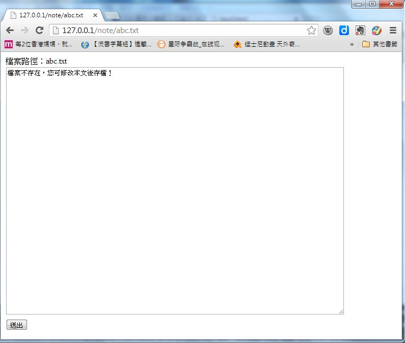

# Node.js -- 表單資料的處理

## Web 的表單資料

在「HTML 網頁設計」這個章節裏，我們曾經介紹過 form 這個標記的用法，以及包含於其中的一群表單標記，讓我們再次複習一下這個主題。

在 HTML 當中，表單 (Form) 是指可以讓使用者進行輸入的元件，其語法是用 `<form> ...</form>` 夾住一堆的輸入元件，這些輸入元件包含 input (輸入)、 textarea (文字區)、 select (選項) 等，其中的 input 還可以根據其 type 欄位顯示成 checkbox, color, date, datetime, datetime-local, email, file, hidden, image, month, number, password, radio, range, reset, search, submit, tel, text, time, url, week 等各種不同的輸入欄形式，以下是一個表單的範例。

```html
<form action="signup" method="post">
帳號: <input type="text" name="user"/><br/>
密碼: <input type="password" name="password"/><br/>
信箱: <input type="email" name="email"/><br/>
生日: <input type="date" name="birthday"/><br/>
照片: <input type="file" name="picture"/><br/>
性別: <input type="radio" name="sex" value="male" checked/> 男
      <input type="radio" name="sex" value="female"/> 女<br/>
血型: <select name="BloodType">
        <option value="A">A 型</option>
        <option value="B">B 型</option>
        <option value="AB">AB 型</option>
        <option value="O">O 型</option>
      </select> <br/>
自我介紹： <br/>
<textarea name="AboutMe">
</textarea> <br/>

<input type="submit" value="送出"/><input type="reset" value="清除"/><br/>
</form>
```

檢視檔案：<https://dl.dropbox.com/u/101584453/wp/code/form.htm>


在上述的範例中，當 submit 類型的送出鈕被按下後，瀏覽器會將這些填寫的資訊，以先前所說的 GET/POST 方式，發送給伺服器，如果 method 欄位是 GET，那麼會採用在 HTTP 表頭網址處傳送 singup?user=xxx&password=xxx .....這樣的形式送出，這種方式會將密碼顯示在瀏覽器的網址列上，比較容易被看到，若 method 欄位是 POST，則會在 HTTP 表頭尾端加上 user=xxx&password=xxx ... 的資訊，不會在網址列上被看到。當然、如果有人監控網路上訊息的話，還是會看得到這些輸入資訊。

若要更安全，則必須採用 HTTPS 的 SSL 方式傳遞，這種方式會對訊息加密編碼，就比較不會有輸入訊息外洩的危險。

node.js 對於 GET/POST 訊息的處理，是以 url 與 querystring 為基礎，然後還有個額外的套件 express 可以進行方便的進階處理，以下我們將介紹這些主題。

## GET 的處理

node.js 在處理 GET 表單訊息時，最基礎的方式是使用 url.parse() 與 querystring.parse() 等兩個函數為基礎的，以下是一個簡單的範例。

檔案：httpget.js

```javascript
http = require('http');
qs = require('querystring');
url = require('url');
util = require('util');

format = function() {
    return util.format.apply(null, arguments);
};

log = console.log;
ip   = "127.0.0.1";
port = 8080;

server = http.createServer(function (req, res) {
  var path = url.parse(req.url),
      parameter = qs.parse(path.query);

  res.writeHead(200, {'Content-Type': 'text/plain'});
  res.write(format("path=%j\n", path));
  res.write(format("parameter=%j\n", parameter));
  res.end();
});

server.listen(port, ip);

console.log(format("Server running at http://%s:%d\n", ip, port));
```

執行結果：

```
D:\Dropbox\Public\wp\code>node httpget
Server running at http://127.0.0.1:8080

```



由於 GET 的傳送方式是透過網址欄，因此您只要在網址上進行修改，就可以看到上述程式會有不同的執行結果。

## POST 的處理

對於 POST 訊息而言，就無法透過修改網址的方式測試了，要示範如何用 node.js 處理 post 訊息，我們必須先有一個
包含表單的 HTML 網頁，然後在 form 欄位內指定 `method="POST"` ，這樣當您填完按下 submit 送出鈕時，網頁中所
填寫的資訊就會附加在 HTTP 表頭的尾部傳送出去。

檔案：httppost.htm

```html
<!DOCTYPE html>
<html>
<head>
<meta charset="utf-8" />
</head>
  <body> 
	<form id="signup" method="POST" action="http://localhost:8080/post">
	  <label>帳號：</label><input type="text" id="user" name="user" value="ccc"/><br/>
	  <label>密碼：</label><input type="text" id="password" name="password" value="1234567"/><br/>
	  <label>標題：</label><input type="text" id="title" name="title" size="80" value="當您死後，您在意的是公墓裏的那塊牌子，還是 facebook 上的日誌與照片呢？"/><br>
	  <textarea name="text" rows=30 cols=80>
如果我死了！我不會在意自己被葬在哪裡，公墓裏有沒有一個骨灰罈或牌子！

但是我會在意自己的「照片、錄影、網誌、facebook、YouTube上的影片、電子書、以及我所創辦的程式人雜誌」是否有人接手、整理或出版。

我不希望死後 facebook 上的資訊就被視為靜止戶而刪除，我不希望網誌上的資訊雜亂無章，我不希望數位相機的照片與錄影從此消失，我不希望那些美好的記憶在家人的腦海裡逐漸模糊！

我希望這些資訊可以變成我的日記、著作，有人幫我剪接這些影片，在喪禮上可以回顧我的一生，我希望我的小孩有空時能透過這些資訊瞭解我，甚至是與已經身在天堂的我對話，當他有的生命遇到疑問時，可以從我的人生經驗當中得到啟發，或者些許的指引與安慰！

如果我的老婆小孩經濟困難，我希望可以從我的數位遺產中找到有價值出版的作品，幫助他們度過難關，如果他們的經濟情況不錯，我希望這些價值就捐獻給公益團體。

要完成這些事，就必須要有一個組織，提供「數位遺產管理」的服務。這需要有一些工具可以擷取出這些數位遺產，需要一些人力可以幫組織與整理，並且需要服務人員對家屬提供適當的協助。所以我想，這需要一整個公司，甚至整個供應鏈的配合。

這是一個全新的領域 -- 「數位殯葬業 + 數位遺產管理事業」，當您抱怨網路行業都已經被 Google 、Facebook 、淘寶等公司壟斷的時候，實體的世界當中仍然有很多的創業機會，等著您去開發！
      </textarea><br/>
	  <input type="submit" value="送出" />
	</form>
  </body>
</html>
```



接著、我們就可以用請求參數 req 的 `on("data", ...)` 事件與接收資料，然後在 `on("end", ...)` 事件
時完成接收並處理 POST 訊息，如以下程式所示。

檔案：httppost.js

```javascript
http = require('http');
qs = require('querystring');
url = require('url');
util = require('util');

format = function() {
    return util.format.apply(null, arguments);
};

log = console.log;
ip   = "127.0.0.1";
port = 8080;

server = http.createServer(function (req, res) {
  var path = url.parse(req.url, true),
      parameter = qs.parse(path.query);

  res.writeHead(200, {'Content-Type': 'text/plain'});
  formData = '';
  req.on("data", function(data) {
    return formData += data;
  });
  req.on("end", function() {
    res.writeHead(200, {"Content-Type":"text/html; charset=utf-8"});
    post = qs.parse(formData);
    log(format("post=%j\n", post));
    user = post.user;
    password = post.password;
    title = decodeURIComponent(post.title);
    text  = decodeURIComponent(post.text);
    res.write("user="+user+"<br/>");
    res.write("password="+password+"<br/>");
    res.write("title="+title+"<br/>");
    res.write("text="+text+"<br/>");
    res.end();
  });
});

server.listen(port, ip);

console.log(format("Server (POST test) running at http://%s:%d\n", ip, port));

```

執行結果：

```
user=ccc
password=1234567
title=當您死後，您在意的是公墓裏的那塊牌子，還是 facebook 上的日誌與照片呢？
text=如果我死了！我不會在意自己被葬在哪裡，公墓裏有沒有一個骨灰罈或牌子！ 但是我會在意
...
...
等著您去開發！ 
```



## 網路記事本

接著、讓我們用一個完整的「網路記事本」範例，來說明 node.js 的表單處理過程，在這個範例中，
我們用了 express 這個套件，以便能更方便的處理網址所對應的不同功能，在執行程式前，請先用
下列指令安裝 express 套件。

```
$ npm install express -g
```

整個網路記事本的專案，您可以從下列網址下載：

網路記事本 (下載點)：[noteserver1.zip](https://dl.dropboxusercontent.com/u/101584453/wp/code/noteserver1.zip)

以下是該程式的執行過程：

```
D:\Dropbox\Public\wp\code\noteserver1>node NoteServer.js
start NoteServer


note ifidie.txt
<!DOCTYPE html>
<html>
<head>
<meta charset="utf-8" />
</head>
....

```

以下是該程式的一些執行畫面，當您在網址上輸入以下內容時，您將可以編輯 ifidie.txt 這個檔案。

```
http://127.0.0.1/note/ifidie.txt
```


編輯完後送出，您可以看到下列儲存訊息，此時如果您在點選 ifidie.txt 這個超連結，就能回到編輯畫面，繼續編輯其內容。


假如您輸入一個原本不存在的檔案名稱時，那麼內容就會顯示「檔案不存在，您可修改本文後存檔！」，然後您同樣可以編輯後
按下「送出」鍵儲存，此時上述程式將會建立一個新的 `abc.txt` 檔案，其內容即為您所輸入的內容。



上述網路記事本的完整程式碼如下所示：

檔案：NoteServer.js

```javascript
var path = require('path');
var fs = require("fs");
var qs = require('querystring');
var express = require("express");
var app = express();	
app.listen(80);

var noteTemplate = "";

fs.readFile("note.htm", "utf8", function(err, file) {
	noteTemplate = file;
});

fs.readFile("save.htm", "utf8", function(err, file) {
	saveTemplate = file;
});

var error = function(err, res) {
	if (err) {
		res.writeHead(404, {'Content-Type': 'text/plain'});
        res.end();
	}
}

var response = function(res, type, text) {
	res.writeHead(200, {'Content-Type': type});
	res.write(text);
	console.log(text);
	res.end();
}
	
app.post('/save/:path', function(req, res){
    console.log('save ' + req.params.path);
	var path = "./"+req.params.path;
    formData = '';
    req.on("data", function (chunk) {
        formData += chunk;
    });

    req.on("end", function () {
        form = qs.parse(formData);
        fs.writeFile(path, form.note, function (err) {
          if (!err)
			response(res, "text/html", saveTemplate.replace("[[?path?]]", req.params.path)
			.replace("[[?path?]]", req.params.path)
			.replace("[[?path?]]", req.params.path).replace("[[?fileText?]]", form.note));
        });
    });	
});

app.get('/note/:path', function(req, res){
    console.log('note ' + req.params.path);
	var path = "./"+req.params.path;
	fs.readFile(path, "utf8", function(err, file) {
		if (err)
			response(res, "text/html", noteTemplate.replace("[[?path?]]", req.params.path)
			.replace("[[?path?]]", req.params.path).replace("[[?fileText?]]", "檔案不存在，您可修改本文後存檔！"));
		else
			response(res, "text/html", noteTemplate.replace("[[?path?]]", req.params.path)
			.replace("[[?path?]]", req.params.path).replace("[[?fileText?]]", file));
	});
});

console.log('start NoteServer\n');

```

檔案：note.htm

```html
<!DOCTYPE html>
<html>
<head>
<meta charset="utf-8" />
</head>
  <body> 
    <form method="POST" action="/save/[[?path?]]">
      <label>檔案路徑：[[?path?]]</label><br>
      <textarea name="note" rows=30 cols=80>
[[?fileText?]]      
      </textarea><br/>
      <input type="submit" value="送出"/>
    </form>
  </body>
</html>
```

檔案：save.htm

```
<!DOCTYPE html>
<html>
<head>
<meta charset="utf-8" />
</head>
<body> 
save:path=<a href="/note/[[?path?]]">[[?path?]]</a>
<pre>
[[?fileText?]]      
</pre>
</body>
</html>
```

檔案：ifidie.txt

```
如果我死了！我不會在意自己被葬在哪裡，公墓裏有沒有一個骨灰罈或牌子！

但是我會在意自己的「照片、錄影、網誌、facebook、YouTube上的影片、電子書、以及我所創辦的程式人雜誌」是否有人接手、整理或出版。

我不希望死後 facebook 上的資訊就被視為靜止戶而刪除，我不希望網誌上的資訊雜亂無章，我不希望數位相機的照片與錄影從此消失，我不希望那些美好的記憶在家人的腦海裡逐漸模糊！

我希望這些資訊可以變成我的日記、著作，有人幫我剪接這些影片，在喪禮上可以回顧我的一生，我希望我的小孩有空時能透過這些資訊瞭解我，甚至是與已經身在天堂的我對話，當他有的生命遇到疑問時，可以從我的人生經驗當中得到啟發，或者些許的指引與安慰！

如果我的老婆小孩經濟困難，我希望可以從我的數位遺產中找到有價值出版的作品，幫助他們度過難關，如果他們的經濟情況不錯，我希望這些價值就捐獻給公益團體。

要完成這些事，就必須要有一個組織，提供「數位遺產管理」的服務。這需要有一些工具可以擷取出這些數位遺產，需要一些人力可以幫組織與整理，並且需要服務人員對家屬提供適當的協助。所以我想，這需要一整個公司，甚至整個供應鏈的配合。

這是一個全新的領域 -- 「數位殯葬業 + 數位遺產管理事業」，當您抱怨網路行業都已經被 Google 、Facebook 、淘寶等公司壟斷的時候，實體的世界當中仍然有很多的創業機會，等著您去開發！
```

